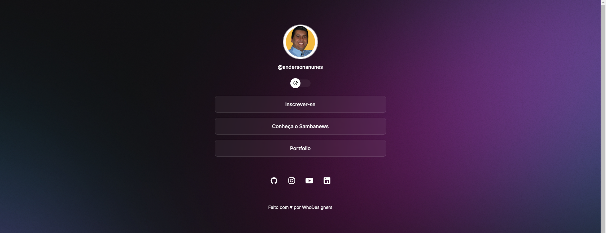

# Discover | Agregador de conteúdo



Este documento tem o objetivo construir um projeto de um agregador de conteúdo do zero, explorando de maneira prática a utilização de ferramentas como HTML, CSS, Javascript, Git e Github. O projeto conta ainda com protótipo do Figma utilizado como referência para a criação das páginas.

## ✒️ Autores
Seguem abaixo todos os responsáveis pela elaboração, criação e aplicação do projeto apresentado neste repositório.
**Anderson Nunes** - *Trabalho Inicial/Documentação*

## 🛠️ Tecnologias Envolvidas

Esse projeto foi desenvolvido com as seguintes tecnologias:

* [HTML]
* [CSS]
* [Javascript]
* [Git]
* [Github]
* [Figma](https://www.figma.com/community/file/1187422022288947321)     - Acesse o protótipo do projeto. É necessário ter conta no [Figma](https://figma.com) para acessá-lo.

## 💻 Projeto

O DevLinks é um agregador de links para usar como cartão de visitas online.

- [Acesse o projeto finalizado, online](https://andersonanunes.github.io/discover)

## :memo: Licença

Esse projeto está sob a licença MIT.

## 🚀 Preparando o ambiente
Essas instruções permitirão que você obtenha uma cópia do projeto em operação na sua máquina local para fins de desenvolvimento e teste.

## 📋 Pré-requisitos

Quais ferramentas serão necessárias roar o projeto?
**[Download do VsCode](https://code.visualstudio.com/download)**

Extensões do **VSCode**
- **Material Icon Theme**
- **Prettier**

Ferramentas Opcionais
**[Download do CMDER](https://cmder.net/)**

### Faça uma cópia do projeto clonando o repositório do GIT

```bash
# Clone o projeto para sua máquina
$ git clone https://github.com/andersonanunes/discover.git

# Acessar a branch
$ git checkout origin
```

## 📌 Changelog

27.10.23 - Upload inicial do Projeto